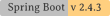

# DRYVE CHALLENGE 1  
en-US: Repository for the recruitment test for the junior java/kotlin job vacancy at [Dryve.com.br](https://dryve.com.br).  
Follow the [SCRUM-KANBAN Project's Painel](https://github.com/users/ROPIMASI/projects/10 "SCRUM KANBAN Project's Painel").  
  
pt-BR: Repositório para o teste de recrutamento à vaga de trabalho de desenvolvedor júnior java/kotlin na [Dryve.com.br](https://dryve.com.br).  
Acompanhe o [Painel SCRUM-KANBAN do Projecto](https://github.com/users/ROPIMASI/projects/10 "SCRUM KANBAN Project's Painel").  
  
*Started 202103112130-UTC/GMT/Z-time*  
*Last change 202104261805-UTC/GMT/Z-time*  
  
[](https://access.redhat.com/documentation/en-us/openjdk/11/ "RedHat OpenJDK 11.0.9")
[](https://spring.io/projects/spring-boot "Spring Boot Project 2.4.3")
[](https://spring.io/projects/spring-boot "Apache-Tomcat 9.0.43")
[](https://github.com/users/ROPIMASI/projects/11 "ROPIMASI MyUtility 0.5.0-beta")
[](https://github.com/users/ROPIMASI/projects/11 "Scrum Kanban Project Painel: Github Projects")


  
&nbsp;  
&nbsp;  
&nbsp;  
  
<a name="whatitis"></a>
## O QUÊ É / WHAT IT IS
pt-BR: Projeto de uma RESTful-API que utiliza-se de um web-service, com finalidade de cadastrar anúncios de venda de veículo. Esta API recebe alguns dados básicos de um veículo, recupera uma informação (o preço) deste veículo em uma API pública do web-service KBB, grava tais informações em seu banco de dados, e responde as mesmas para o requisitante.  
pt-BR:  **Agora, projeto _refatorado_ em nova fase** de desenvolvimento volutário para portfólio.  
> **Nota: a próxima versão do projeto será implementada e documentada apenas em inglês.**  
  
en-US: Project of a RESTful-API that uses a web-service, in order to register ads for vehicle sales. This API receives some basic data from a vehicle, retrieves an information (the price) of this vehicle in a public API of the KBB web-service, records such information in its database, and responds to the requestor.  
en-US: **Now, _refactored_ project in a new phase** of voluntary development for portfolio.  
  
&nbsp;  
&nbsp;  
&nbsp;  
  
<a name="list-of-content"></a>
## LIST OF CONTENT
* [WHAT IT IS](#whatitis)
* [VERSIONS](#versions)
  + [VERSIONING](#versioning)
    - [Example](#versioning-example)
  + [CURRENT VERSION](#current)
  + [LAST VERSION](#last)
* [GUIDELINE ROADMAP](#guideline)
  + [FUTURE VERSION](#future)
  + [OBJECTIVE VERSION](#objective-version)
* [TECHNOLOGIES](#technologies)
* [GITFLOW INFLUENCES](#gitflow)
* [PROJECT ARCHITETURE](#project-architeture)
  + [CLASSES AND THEIR PURPOSES](#classes-purposes)
* [AUTHOR](#author)  
  
&nbsp;  
&nbsp;  
&nbsp;  
  
<a name="versions"></a>
## VERSÕES / VERSIONS
  
<a name="versioning"></a>
### VERSIONING GUIDELINES
In a team project, it is very important to know and follow the specifications of the project version. Although at the moment **DRYVE_CHALLENGE_1**'s status is under early development (as it has not its first stable version [1.0.0-released] released yet) its project already is designed under [**_SemVer_** (Semantic Versioning Specification)](http://semver.org/).  
Thus, **DRYVE_CHALLENGE_1** uses **_SemVer_** for its versioning. **_SemVer_** is a specification (set of rules) that tells (or dictates) us how to use the numbers (and some letters) on the _versioning-expression_ (**_VerExpr_**). More specifically, **DRYVE_CHALLENGE_1** uses the following standardization: **_Major.Minor.Patch-ReleaseStatus+Build_**, where:  
* The standard values of **_Major_**, **_Minor_**, and **_Patch_** for the _VerExpr_ are as follows:
  + Positive integer decimal numbers, without zero remaining on the left;
  + **_Major_** version represents wider changes in the project, which affects the main structure of the project, or its main objectives, or the last user API released;
  + **_Minor_** version represents smaller changes in the project, which don't affect above itens, but affect the amount of the application fuatrures with a new one or more, or remove an existing feature previouslly released;
  + **_Patch_** version represents specific changes which goals to fix or improve some feature, or undesired behavior in the application.  
* The standard flags of **_ReleaseStatus_** for the **_VerExpr_** are as follows:
  + **_dev_**: in early development, being coding, structuring, refatoring, has no all expected methods, usage not encouraged;
  + **_alpha_**: in development, first test phase, it's encouraged usage for **test only** by people involved with software development, at self-own risk;
  + **_beta_**: in pre-release version, general public usage is acceptable, however, **only for test**, usage is a choice at self-own risk;
  + **_released_**: it is a relatively stable version, stable in proportion to the effectiveness of the tests; bugs are possible to appear, so it would come back to a _hotfix-branch_ if needed.  
* The standard values of **_Build_** for the _VerExpr_ are as follows:
  + A 12-digit numeric sequence, positive integer decimal digits, formatted somewhat similar to PostgreSQL DateTime YYYYMMDDhhmm;
  + The initial 4 digits (YYYY) represent the year;
  + The next 2 digits (MM) represent the month;
  + The next 2 digits (DD) represent the day;
  + The next 2 digits (hh) represent the hour;
  + The following 2 digits (mm) represent the minutes;
  + All referring to the moment when the developer builds/exports the application container **(* 1)**.  
  
<a name="versioning-example"></a>
> Example of **_Build_**: "202112311745".  
  
> (* 1) The numerical sequence _Build_ necessarily refers to Greenwich Mean Time (GMT), also known as Coordinated Universal Time (UTC), or "Z time" or "Zulu time".  
  
> Full example of **_Versioning-Expression_**: `1.2.3-released+202112311745`, meaning `1`._ ._ version fully implemented according to the project and its backlog; added by _ .`2`._ additionals features to the main version, according to the project backlog and its issues priorities in the **_SCRUM life cycle_**; added by _ ._ .`3` patches fixed in this mentioned lastest version following the **_GITFLOW life cycle_**, that means, it is a released version after passed by the tests in **_alpha_** and **_beta_** pre-releases; and finally, it was/would specifically build at the year 2021 month 12 (December) day 31 at 17:45h at UTC/GMT/Z-time/Zulu-time (17hours and 45minutes equal 5pm and 45minutes in some idioms).  
  
&nbsp;  
  
<a name="current"></a>
### Versão atual / CURRENT VERSION 0.2.1-beta
Todas as funcionalidades da versão anteior, mais... / All features from last version, plus...  
+ Correção de cadastro de modelos / Models registry correction
  - Creating null properties' value, `500 internal server error` on request:  
  > POST /models HTTP/1.1  
  > Host: localhost:8080  
  > Content-Type: application/json
  > Body-Data: __an_object_representation__   
  - Which responses:
  > {
  >   "trace": "org.springframework.dao.DataIntegrityViolationException: not-null property references a null or transient value : dev.ronaldomarques.dryve.challenge1.domain.model.entity.BrandEntity.name; nested exception is org.hibernate.PropertyValueException: not-null property references a null or transient value : dev.ronaldomarques.dryve.challenge1.domain.model.entity.BrandEntity.name\r\n\tat org.springframework.orm.jpa.vendor.HibernateJpaDialect.convertHibernateAccessException(HibernateJpaDialect.java:294)\r\n\tat org.springframework.orm.jpa.vendor.HibernateJpaDialect.translateExceptionIfPossible(HibernateJpaDialect.java:233)\r\n\tat org.springframework.orm.jpa.JpaTransactionManager.doCommit(JpaTransactionManager.java:566)\r\n\tat org.springframework.transaction.support...",
  >   "message": "not-null property references a null or transient value : dev.ronaldomarques.dryve.challenge1.domain.model.entity.BrandEntity.name; nested exception is org.hibernate.PropertyValueException: not-null property references a null or transient value : dev.ronaldomarques.dryve.challenge1.domain.model.entity.BrandEntity.name",
  >   "path": "/models"
  > }  
+ Features list and its breaf descriptions' corrected.
  - On http-method `GET`, URI-end-point `/help`.
+ BUG FOUND!
  - On `II.3.2.2.2`;
  - Class `MotorVehiclesController`;
  - Method `.adicionar()`;
  - Description: ...  
  
&nbsp;  
  
<a name="last"></a>
### Versão anterior / LAST VERSION 0.2.0-beta
Todas as funcionalidades da versão anteior, mais... / All features from last version, plus...  
+ Cadastro de marcas / Brands registry
+ Cadastro de modelos / Models registry
+ Cadastro de relações modelo-ano / Model-year relation registry
+ Cadastro de veículos-anunciados *(automotores)* / Advertised vehicles registry (motor vehicles)
  
&nbsp;  
  
### Versão anterior / LAST VERSION 0.1.0-beta
+ Listagem de marcas / Brands listing
+ Listagem de modelo / Models listing
+ Listagem de relações modelo-ano / Model-year relation listing
+ Listagem de veículos-anunciados (automotores) / Advertised vehicles listing (motor vehicles)  
  
###### More details about the past versions _(end-points, methods, features)_, see [project documentation, at `CHANGELOG.md`](project-resources/documentation/CHANGELOG.md "CHANGELOG.md").
  
&nbsp;  
&nbsp;  
&nbsp;  
  
<a name="guideline"></a>
## DIRETRIZES ROTEIRO / GUIDELINE ROADMAP
  
<a name="future"></a>
### Futura versão / FUTURE VERSION 0.3.0-beta
All features from last version, plus...  
+ Integration with KBB public API, geting the price for `price_KBB` object's atribute;
+ Brands exclusion
+ Models exclusion
+ Model-year relation exclusion
+ Motor vehicles exclusion
&nbsp;  
  
### Futura versão / FUTURE VERSION 0.4.0-beta
+ Brands update
+ Models update
+ Model-year relation update
+ Motor vehicles update
&nbsp;  
  
<a name="objective-version"></a>
### Versão objetivo final / OBJECTIVE VERSION 1.0.0-released
+ Autoapresentação: retorna pequeno texto com nome e versão da aplicação, e uma instrução inicial. / Self-presentation: returns a smal text with application's version name, and an initial introduction.
+ Sumário de funcionalidades: retorna uma lista de cada end-point disponível no projeto e uma breve descrição de sua função. / Summary fo the features: returns a list of each avalable end-point in the project and a breif description of its fuction.
+ Listagem de cada URI / Listing of each URI
  - Listagem de todos os objetos registrados em seu respectivo URI. Retorna uma `ResponseEntity` com uma `List` vazia ou populada no `body` da `Response`. / List of all objects registered in their respective URI. Returns a `ResponseEntity` with an empty or populated `List` in `body` of the `Response`.
  - Filtrando por uma determinada 'placa' (ou parte dela) informada pelo usuário. Retorna uma `ResponseEntity` com uma `list` vazia ou populada no `body` da `Response`. / Filtering for a particular 'plate' (or part of it) informed by the user. Returns a `ResponseEntity` with an empty or populated `List` in `body` of the `Response`.
+ Cadastro de marcas / Registry of brands
  - Retorna uma `ResponseEntity` com uma instância do objeto persistido/excluído no `body` da `Response`, em caso de procedimento bem sucedido; caso contrário `ResponseEntity` não tem instância do objeto (nulo) no `body` da `Response`. / Returns a `ResponseEntity` with an instance of the just persisted/deleted object in `body` of the `Response`, in case of successful procedure; Otherwise `Response` has no instance of the object (null) in `body` of the `Response`.
+ Consulta de **uma** marca específica / Consultation of **a** specific brand
  - Por **um** `id`. Retorna uma `ResponseEntity` com uma instância do objedo consultado, ou nulo, no `body` da `Response`. / By **an** `id`. Returns a `ResponseEntity` with an instance of the consulted object, or null, in `body` of the `Response`.
  - Por **um** `nome` da marca. Retorna uma `ResponseEntity` com uma instância do objedo consultado, ou nulo, no `body` da `Response`. / By **a** brand's `name`. Returns a `ResponseEntity` with an instance of the consulted object, or null in `body` of the `Response`.
+ Cadastro de modelos / Registry of models
  - Retorna uma `ResponseEntity` com uma instância do objedo persistido/excluído no `body` da `Response`, em caso de procedimento bem sucedido; caso contrário `ResponseEntity` não tem instância do objeto (nulo) no `body` da `Response`. / Returns a `ResponseEntity` with an instance of the just persisted/deleted object in `body` of the `Response`, in case of successful procedure; Otherwise `Response` has no instance of the object (null) in `body` of the `Response`.
+ Consulta de **um** modelo / Consultation of a specific model
  - Por **um** `id`. Retorna uma `ResponseEntity` com uma instância do objedo consultado, ou nulo, no `body` da `Response`. / By **an** `id`. Returns a `ResponseEntity` with an instance of the consulted object, or null, in `body` of the `Response`.
  - Por **um** `nome` do modelo. Retorna uma `ResponseEntity` com uma instância do objedo consultado, ou nulo, no `body` da `Response`. / By **a** model's `name`. Returns a `ResponseEntity` with an instance of the consulted object, or null, in `body` of the `Response`.
+ Cadastro de relações modelo-ano / Registry of model-year relation
  - Retorna uma `ResponseEntity` com uma instância do objedo persistido/excluído no `body` da `Response`, em caso de procedimento bem sucedido; caso contrário `ResponseEntity` não tem instância do objeto (nulo) no `body` da `Response`. / Returns a `ResponseEntity` with an instance of the just persisted/deleted object in `body` of the `Response`, in case of successful procedure; Otherwise `Response` has no instance of the object (null) in `body` of the `Response`.
+ Consulta de **uma ou mais** relação modelo-ano / Consultation of **one or more** model-year relation
  - Por **um** `id`. Retorna uma `ResponseEntity` com uma instância do objedo consultado, ou nulo, no `body` da `Response`. / By **an** `id`. Returns a `ResponseEntity` with an instance of the consulted object, or null, in `body` of the `Response`.
  - Por **um** `nome` do modelo. Retorna uma `ResponseEntity` com uma `list` populada ou vazia de instância do objedo consultado, no `body` da `Response`. By **a** model's `name`. Returns a `ResponseEntity` with an `list` populated or empty of instance of the consulted object, in `body` of the `Response`.
+ Cadastro de veículo-anunciado (automotor) / Registry of advertised-vehicle (motor vehicles)
  - Retorna uma `ResponseEntity` com uma instância do objedo persistido/excluído no `body` da `Response`, em caso de procedimento bem sucedido; caso contrário `ResponseEntity` não tem instância do objeto (nulo) no `body` da `Response`. / Returns a `ResponseEntity` with an instance of the just persisted/deleted object in `body` of the `Response`, in case of successful procedure; Otherwise `Response` has no instance of the object (null) in `body` of the `Response`.
+ Consulta de **um** veículo-anunciado. / Consultation of a specific advertised vehicle (motor vehicle)
  - Por **uma** `placa`. Retorna uma `ResponseEntity` com uma instância do objedo consultado, ou nulo, no `body` Response. / By **a** `plate`. Returns a `ResponseEntity` with an instance of the consulted object, or null, in `body` of the `Response`.  
  
###### More details about the future versions _(end-points, methods, features)_, see [project documentation, at `ROADMAP.md`](project-resources/documentation/ROADMAP.md "ROADMAP.md").
  
&nbsp;  
&nbsp;  
&nbsp;
  
<a name="technologies"></a>
## TECNOLOGIAS / TECHNOLOGIES
+ Java, Spring Boot, Spring Web, Spring Data JPA (Hibernate), Maven, PostgreSQL, Apache-Tomcat, Postman;
+ Built as a standalone/self-contained application with "file.jar" packaging (the famous "fat-jar", which contains the built-in Apache-Tomcat server);  
  
&nbsp;  
&nbsp;
  
<a name="gitflow"></a>
## INFLUÊNCIAS DE GITFLOW / GITFLOW INFLUENCES
  
### *GITFLOW*'s Basic Structure In This Projeto
+ **_main_**: primary branch, the initial one, and the main one, which receive (merging) else branches, then to perform the full-test of the version before to release it. This is the branch from which the "release branch" occurs; This branch must never be deleted;
+ main/**_develop_**: the base-branch to the application development, although it is possible to occur some implementation in it, it is discouraged, as exists specifics branches to the features coding, such as the pointed ones below. This branch must never be deleted;
  - main/develop/**_feature_**/**_shot_alias_**: this branch is created exclusively for feature implementation, a chosen feature according to the Project Backlog and Sprint Backlog, as it can be noticed through this feature's name. After the feature is completed and merged with the source branch, you can (or not) delete the branch according to the development team's culture and the needs of the project;  
  - main/develop/**_bugfix_**/**_bug's_short_alias_**: this branch is created exclusively for currection of the bug (or else issues) mentioned at the branch's alias, which used to be found in test phase (or Q&A team). After the job on the bug/issue has been completed and merged with the source branch, you can (or not) delete the branch according to the development team's culture and the needs of the project;  
+ main/**_hotfix_**/**_hotfix's_short_alias_**: this branch is created exclusively for correction of the max priority bugs (or else issues) mentioned at the branch's alias, which are found in the prerelease test phase (or Q&A team) or more commonly found by the user, so reported after released.  
  
&nbsp;  
&nbsp;  
&nbsp;
  
<a name="project-architeture"></a>
## ARQUITETURA DO PROJETO / PROJECT ARCHITECTURE
Description...  
  
&nbsp;
  
### Pacotes / Packages
**[root]**  
**/**
* src/
  + main/
    + java/
      - **dev.ronaldomarques.dryve.challenge1/**
        - api/
          - controller/
          - exception/
          - **packages...it ll be continued...**
        - domain/
          - model
            - entity
            - repository
          - service
          - **packages...it ll be continued...**
        - **`files`...it ll be continued...**
    + resources
      - libs/
        - `my-java-utility-pack-0.4.0-beta+202103250350.jar`
      - `application.properties`
      - `import.sql`
  + test/
    + java/
      - **dev.ronaldomarques.dryve.challenge1/**
        - `DryveChallenge1ApplicationTests.java`
        - `MyPersonalTests.java`
* project-resources/
  + documentation/
    - screenshots/
      - `several files`
    - test-results/
      - `several files`
    - `CHANGELOG.md`
    - `CONTRIBUTORS.md`
    - `REQUIREMENTS.md`
    - `ROADMAP.md`
    - `Dryve-Challenge-1-Backend-Invitation.pdf`
  + images/
    - icons/
      - `several files`
    - logos/
      -  `several brand-folders/`
    - `several files`  

/`README.md`
/`pom.xml`
  
&nbsp;
  
<a name="classes-purposes"></a>
### Classes e seus propósitos / CLASSES AND THEIR PURPOSES
Description...  
  
&nbsp;  
&nbsp;  
&nbsp;  
  
<a name="author"></a>
## AUTHOR
### Ronaldo Marques.
###### | https://ronaldomarques.dev | [linkedin @ronaldo marques](https://linkedin.com/in/ropimasi/) | [twitter @ropimasi](https://twitter.com/ropimasi/) | [insta @ropimasi](https://instagram.com/ropimasi/) | ronaldomarques@email.com |
### Thank you ```_/\_``` .  
&nbsp;  
  
  
