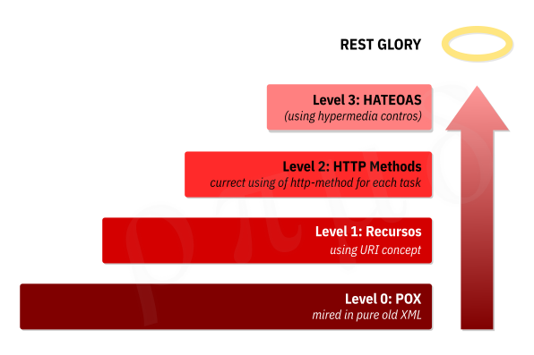

# REQUIREMENTS TO "DRYVE CHALLENGE 1"
List of all requirements classified by type.  
  
*Started 202103301948-UTC/GMT/Z-time*  
*Last change 202104081535-UTC/GMT/Z-time*  
  
&nbsp;  
&nbsp;  
&nbsp;
  

## RECRUITMENT REQUIREMENTS
* Spring Boot with Java or Kotlin; 
  + It's used STS-EclipseIDE (Spring Tool Suite), which has Spring Boot Starter embedded;
  + It's imported from Spring Initializr (https://start.spring.io/) the needed packages.
* Maven or Gradle; 
  + It's a Maven Spring type project from STS-EclipseIDE;
  + It's used Maven Dependencies managed by Apache-Maven and `pom.xml`.
* Relational database; 
  + It's used PostgreSQL, specifically, I am trying PostgreSQL v12.2 and v13.2. Both work sucessefully;
* REST APIs for registration and searching of data. 
  + It's beeing implemented using REST concepts; 
  + Its goal is **Level 3**. 
  >   

&nbsp;  
&nbsp;  
&nbsp;  

## PLUS RECRUITMENT REQUIREMENTS
* `UUID` typed atributes (**U**niversally **U**nique **ID**entifier) for some classes; 
  + Using `UUID` on (**table**._column_) `model_year.id`, `model.id`, and `brand.id`, as mentioned in the **DRYVE invitation's SQL-script** [(see the original file in project's documentation, page 3)](Dryve-Challenge-1-Backend-Invitation.pdf "DRYVE invitation").
* Unitary tests; 
  + Still in the process of learning...
* Integration tests; 
  + It's used **_POSTMAN_** and **_Chrome Browser_** as the testing tools. 
* Database versioning (flyway or liquibase); 
  + It's used **_FlyWay_** as a Maven Depedency... /* TODO: review this discribing... */
* Dockerfile for project's container; 
  + Future process of learning...
* Docker compose for project's dependencies; 
  + Future process of learning...
* Publication of registration events using RabbitMQ. 
  + Soon process of learning...  

&nbsp;  
&nbsp;  
&nbsp;  

## BUSINESS REQUIREMENTS

&nbsp;  

### API receives information to registration
* **Plate**
  + Plate's value will be evaluated, according to current Mercosul's regulations, with an 8 characters combination of letters and numbers;
  + Plate's value must be unique, it can not be duplicated.
* **Brand Id**
  + Brand Id's value will be evaluated, as requested in [Plus Recruitment Requirements](#plus-recruitment-requirements), with `UUID` version 4.
* **Model Id**
  + Model Id's value will be evaluated, as requested in [Plus Recruitment Requirements](#plus-recruitment-requirements), with `UUID` version 4;
  + Model Id's value must have, as requested in the [Business Requirements (Model-Year-Relation as Mandatory)](#bus-req-model-year-rel), a referencer record in **Model-Year-Relation**.
* **Price in Advertising**
  + Price in Advertising's value will be evaluated, as mentioned in the **DRYVE invitation's SQL-script** [(see the original file in project's documentation, page 3)](Dryve-Challenge-1-Backend-Invitation.pdf "DRYVE invitation"), using monetary values.
* **Vehicle Year**
  + Vehicle Year's value will be evaluated, as mentioned in the **DRYVE invitation's SQL-script** [(see the original file in project's documentation, page 3)](Dryve-Challenge-1-Backend-Invitation.pdf "DRYVE invitation"), using numeric positive integer values;
  + Vehicle Year's value must have, as requested in the [Business Requirements (Model-Year-Relation as Mandatory)](#bus-req-model-year-rel), a referencer record in **Model-Year-Relation**.  

&nbsp;  
  
### The Application Uses a Model-Year-Relation as Mandatory Condition for Vehicles Registry
Considering the input data in the application, only vehicles which match/reference into **Model Year Relation** can be recorded.
* **Model Year Relation** must have **Id** as _Primary Key_;
  + Model Year Relation Id's value will be evaluated, as mentioned in the **DRYVE invitation's SQL-script** [(see the original file in project's documentation, page 3)](Dryve-Challenge-1-Backend-Invitation.pdf "DRYVE invitation"), using `UUID` version 4.
* **Model Year Relation** must have **Model Id** as _Foreign Key_;
  + Model Id's value will be evaluated, as requested in [Tchnical Requirements](#technical-requirements), by a _foreign key_ from **model entity's** _primary key_.
* **Model Year Relation** must have **Vehicle Year**;
  + Vehicle Year's value will be evaluated, as requested in [Business Requirements (API Receives)](#bus-req-api-receive), using numeric positive integer values.
* **Model Year Relation** must have **KBB Id**;
  + KBB Id's value will be evaluated, as mentioned in the **DRYVE invitation's SQL-script** [(see the original file in project's documentation, page 3)](Dryve-Challenge-1-Backend-Invitation.pdf "DRYVE invitation"), using numeric positive integer values.  

&nbsp;  

### The Application Provides General Listing
* **Full-records** listing: basic **vehicles** data;
  + Vehicle Id;
  + Vehicle Plate;
  + Vehicle Brand;
  + Vehicle Model.
* **Full-records** listing: **brands** data;
  + Brand Id;
  + Brand Name.
* **Full-records** listing: **models** data;
  + Model Id;
  + Model Name;
  + Brand Id (_foreign key_).
* **Full-records** listing: **model-year-relation** data.
  + Model-Year-Relation Id;
  + Model Id (_foreign key_);
  + Vehicle Year;
  + KBB Id.  

&nbsp;  

### The Application Provides Specific Searching
* Searching by **vehicle's plate** listing: basic **vehicles** data;
  + Vehicle Id;
  + Vehicle Plate;
  + Vehicle Brand;
  + Vehicle Model.
* Searching by **vehicle's id** listing: complete-detailed **vehicles** data.
  + Vehicle Id;
  + Vehicle Plate;
  + Model Year Relation Id;
    - Model Id;
      - Model Name;
      - Brand Id.
        - Brand Name.
    - Vehicle Year.
  + Price in Advertising;
  + Price in KBB API;
  + Registry Date.  

&nbsp;  
&nbsp;  
&nbsp;  

## TECHNICAL REQUIREMENTS
  
&nbsp;  

### Relational Integrity of Data
The entity representing the **Advertised Vehicle** to being persisted on the database will carry a **chain-of-keys** about **Brands**,
**Models**, and **Vehicles** as requested in the **DRYVE invitation's description** [(see the original file in project's documentation,
page 2)](Dryve-Challenge-1-Backend-Invitation.pdf "DRYVE invitation"), in a so-called 'model_year_id' attribute. Analyzing ...

  - `plate` will be an `String` attribute of `VehicleEntity` class in Java code, and `plate` will be an `character varing` attribute of `vehicle` table on DB.
  > Analysis:
  >  + `VehicleEntity` will be an *entity class* in Java code, and `vehicle` will be an *entity table* on DB.  

* **Advertising Price** must be a montary value;
  > Analysis:
  >  + Advertising Price's value, obviously, need to be grater than "0.00";
  >  + `priceAdv` will be an `BigDecimal` attribute of `VehicleEntity` class in Java code, and `price_adv` will be an `numeric(12,2)` attribute of `vehicle` table on DB.  

* **Model-Year-Relation** 
  > FK on APP.DB.modelyear table, according APP's verification below.  
  + ModelId (ex: ‘5bc16064-d3ee-4aed-a264-a914233d0c4f’)
    > APP verify if exists this model and below year together on APP.DB.modelyear table so get.modelyear.model_id.  
  + VehicleYear
    > APP verify if exists this year and above model together on APP.DB.modelyear table so get.modelyear.year.  

&nbsp;  
&nbsp;  
&nbsp;  

## TECHNICAL REQUIREMENTS
* **Brand** must have an `id` attribute preferably typed as `UUID` (ex: "ca43ec74-5bb0-4288-ab11-5df094ca4dc4");
  > Analysis:
  >  + `BrandEntity` will be an *entity class* in Java code, and `brand` will be an *entity table* on DB;
  >  + Although would be possible making an attribute `name` as the identifier and primary key in this entity, basing on the concept all vehicle brands have their names uniques to order to copyrights rules, this project it will be adopting a different attribute as object/record-identifier, up-to-now, allowing 2 or more brands with the same name, maybe to attempt external-client applications' needs:
  >    - `id` will be an `UUID` attribute of `BrandEntity` class in Java code, and `id` will be an `uuid`, primary key, attribute of `brand` table on DB;
  >    - `id` will be used to object-association to `ModelEntity` class in Java code, and `id` will be foreign key to `model` table on DB.  

* **Model** must have an `id` attribute preferably typed as `UUID` (ex: "ca43ec74-5bb0-4288-ab11-5df094ca4dc4");
  > Analysis:
  >  + `ModelEntity` will be an *entity class* in Java code, and `model` will be an *entity table* on DB;
  >  + `id` will be an `UUID` attribute of `BrandEntity` class in Java code, and  `id` will be an `uuid`, primary key, attribute of `models` table on DB;
  >  + `id` will be used to object-association to `ModelYearEntity` in Java code, and to `models` on DB.  

&nbsp;  
### API performs external search
Get the vehicle's price on KBB table https://6048bdf1fb5dcc0017968e3f.mockapi.io/api/v1/kbb{/.../...} Ex: https://6048bdf1fb5dcc0017968e3f.mockapi.io/api/v1/kbb/prices/1  

&nbsp;  
### APP saves every vehicle data on relational DB
  Plate			/* given from user */
  AdvertisingPrice	/* given from user */
  modelyearId		/* APP attributes this FK according business rules pointed above */
	VehicleYear		/* gotten from APP.DB.modelyear.year table if the given year from user exists on AP.DB.modelyear table */
	/* models and brand also is registered */
  KBBPrice		/* gotten from external api */
  RegistryDate		/* gotten form system */
  
&nbsp;  
### Brands, Models, and Vehicles (at least) must have a FK chain between them.
Ex: I'll do Brands, Models, modelyear-Relation and Vehicles.
  
  
### Plate is UNIQUE in Vehicles.
  
  
### It is mandatory all vehicle registering must be related to an existing brand, model, and year pre-registered on API-DB and KBB-API.
  
  
### The result of a vehicle searching on this APP must follow the template:
{
  "Plate": "XYZ-1234",
  "AdvertisingPrice": 1234.56,
  "VehicleYear": 2020,
  "KBBPrice": 120000.00,
  "RegistryDate": "2020-05-18",
  "Brand": "FIAT",
  "Model": "UNO"
}  
  
&nbsp;  
&nbsp;  
&nbsp;
  

## AUTHOR
### Ronaldo Marques.
###### | https://ronaldomarques.dev | [linkedin @ronaldo marques](https://linkedin.com/in/ropimasi/) | [twitter @ropimasi](https://twitter.com/ropimasi/) | [insta @ropimasi](https://instagram.com/ropimasi/) | ronaldomarques@email.com |
### Thank you _/\_ .  
&nbsp;  
  
  